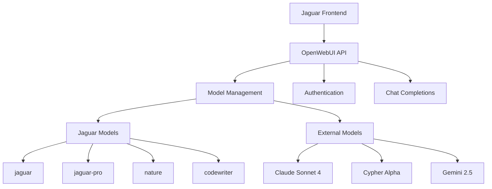

# OpenWebUI Integration Guide

## Overview

OpenWebUI serves as the backbone of Jaguar's AI interface, providing a self-hosted, feature-rich platform for managing AI models and API endpoints. This guide covers setup, configuration, and integration patterns for the Jaguar SDK.

## Architecture



## Setup & Configuration

### 1. Environment Variables

```bash
# .env configuration
JAGUAR_BASE_URL=https://ai.thespatialnetwork.net
JAGUAR_API_KEY=sk-your-api-key-here

# Optional: Redis for caching
REDIS_URL=redis://localhost:6379
```

### 2. Provider Configuration

```typescript
// lib/ai/providers.ts
import { createOpenAI } from "@ai-sdk/openai";

const jaguarProvider = createOpenAI({
  baseURL: `${process.env.JAGUAR_BASE_URL}/api`,
  apiKey: process.env.JAGUAR_API_KEY,
});

export const myProvider = customProvider({
  languageModels: {
    // Core Jaguar models
    "chat-model": jaguarProvider("jaguar"),
    "jaguar-pro": jaguarProvider("jaguar-pro"),
    nature: jaguarProvider("nature"),
    codewriter: jaguarProvider("codewriter:latest"),

    // External models
    "anthropic/claude-sonnet-4": jaguarProvider("anthropic/claude-sonnet-4"),
    "openrouter/cypher-alpha:free": jaguarProvider(
      "openrouter/cypher-alpha:free"
    ),
  },
});
```

## API Endpoints

### Authentication

OpenWebUI uses Bearer token authentication:

```javascript
const headers = {
  Authorization: `Bearer ${process.env.JAGUAR_API_KEY}`,
  "Content-Type": "application/json",
};
```

### Available Endpoints

#### 1. Health Check

```bash
GET /api/health
# Returns: HTML page or health status
```

#### 2. List Models

```bash
GET /api/models
Authorization: Bearer sk-your-key

# Response:
{
  "data": [
    {
      "id": "jaguar",
      "name": "Jaguar (lite)",
      "object": "model",
      "created": 1751068187,
      "owned_by": "openai"
    }
  ]
}
```

#### 3. Chat Completions

```bash
POST /api/chat/completions
Authorization: Bearer sk-your-key
Content-Type: application/json

{
  "model": "jaguar",
  "messages": [
    {
      "role": "user",
      "content": "Hello, how can you help me?"
    }
  ],
  "stream": false,
  "max_tokens": 150
}
```

## Model Management

### Available Models

#### Jaguar Core Models

- **jaguar**: Primary AI developer agent
- **jaguar-pro**: Advanced capabilities
- **nature**: Ecological focus
- **codewriter:latest**: Code optimization

#### External Models

- **anthropic/claude-sonnet-4**: Advanced reasoning
- **anthropic/claude-opus-4**: Most capable
- **openrouter/cypher-alpha:free**: Free general model
- **google/gemini-2.5-flash**: Fast responses

### Model Selection Strategy

```javascript
const selectModel = (taskType) => {
  const modelMap = {
    coding: "codewriter",
    architecture: "jaguar-pro",
    sustainability: "nature",
    general: "jaguar",
    reasoning: "anthropic/claude-sonnet-4",
  };

  return modelMap[taskType] || "jaguar";
};

// Usage
const model = selectModel("coding");
const response = await chat(model, messages);
```

## Integration Patterns

### 1. Basic Chat Integration

```typescript
// hooks/use-jaguar-chat.ts
import { useChat } from "@ai-sdk/react";

export function useJaguarChat(modelId = "jaguar") {
  return useChat({
    api: "/api/chat",
    initialMessages: [],
    body: {
      selectedChatModel: modelId,
      selectedVisibilityType: "private",
    },
  });
}

// Usage in component
export function ChatComponent() {
  const { messages, input, handleInputChange, handleSubmit } =
    useJaguarChat("nature");

  return (
    <div>
      {messages.map((message) => (
        <div key={message.id}>
          <strong>{message.role}:</strong> {message.content}
        </div>
      ))}
      <form onSubmit={handleSubmit}>
        <input value={input} onChange={handleInputChange} />
        <button type="submit">Send</button>
      </form>
    </div>
  );
}
```

### 2. Model Switching

```typescript
// components/model-selector.tsx
import { useState } from "react";
import { chatModels } from "@/lib/ai/models";

export function ModelSelector({ onModelChange }) {
  const [selectedModel, setSelectedModel] = useState("jaguar");

  const handleChange = (modelId) => {
    setSelectedModel(modelId);
    onModelChange(modelId);
  };

  return (
    <select
      value={selectedModel}
      onChange={(e) => handleChange(e.target.value)}
    >
      {chatModels.map((model) => (
        <option key={model.id} value={model.id}>
          {model.name} - {model.description}
        </option>
      ))}
    </select>
  );
}
```

### 3. Streaming Responses

```typescript
// lib/streaming-chat.ts
export async function streamChat(model, messages) {
  const response = await fetch("/api/chat/completions", {
    method: "POST",
    headers: {
      Authorization: `Bearer ${process.env.JAGUAR_API_KEY}`,
      "Content-Type": "application/json",
    },
    body: JSON.stringify({
      model,
      messages,
      stream: true,
    }),
  });

  const reader = response.body?.getReader();
  const decoder = new TextDecoder();

  while (true) {
    const { done, value } = await reader.read();
    if (done) break;

    const chunk = decoder.decode(value);
    const lines = chunk.split("\n");

    for (const line of lines) {
      if (line.startsWith("data: ")) {
        const data = line.slice(6);
        if (data === "[DONE]") return;

        try {
          const parsed = JSON.parse(data);
          const content = parsed.choices[0]?.delta?.content;
          if (content) {
            yield content;
          }
        } catch (e) {
          console.error("Parse error:", e);
        }
      }
    }
  }
}
```

## Error Handling

### Common Error Patterns

```typescript
// lib/openwebui-errors.ts
export class OpenWebUIError extends Error {
  constructor(public status: number, public code: string, message: string) {
    super(message);
    this.name = "OpenWebUIError";
  }
}

export const handleOpenWebUIResponse = async (response: Response) => {
  if (!response.ok) {
    const error = await response.json();

    switch (response.status) {
      case 401:
        throw new OpenWebUIError(401, "unauthorized", "Invalid API key");
      case 400:
        throw new OpenWebUIError(
          400,
          "bad_request",
          error.detail || "Bad request"
        );
      case 404:
        throw new OpenWebUIError(404, "not_found", "Model not found");
      default:
        throw new OpenWebUIError(response.status, "unknown", "Unknown error");
    }
  }

  return response;
};
```

### Retry Logic

```typescript
// lib/retry-logic.ts
export async function withRetry<T>(
  fn: () => Promise<T>,
  maxRetries = 3,
  delay = 1000
): Promise<T> {
  for (let i = 0; i < maxRetries; i++) {
    try {
      return await fn();
    } catch (error) {
      if (i === maxRetries - 1) throw error;

      // Exponential backoff
      await new Promise((resolve) =>
        setTimeout(resolve, delay * Math.pow(2, i))
      );
    }
  }

  throw new Error("Max retries exceeded");
}

// Usage
const response = await withRetry(() =>
  fetch("/api/chat/completions", {
    /* options */
  })
);
```

## Performance Optimization

### 1. Connection Pooling

```typescript
// lib/connection-pool.ts
import { Agent } from "https";

const httpsAgent = new Agent({
  keepAlive: true,
  maxSockets: 10,
  maxFreeSockets: 5,
  timeout: 60000,
  freeSocketTimeout: 30000,
});

export const optimizedFetch = (url: string, options: RequestInit) => {
  return fetch(url, {
    ...options,
    // @ts-ignore
    agent: httpsAgent,
  });
};
```

### 2. Response Caching

```typescript
// lib/response-cache.ts
const cache = new Map();

export async function cachedRequest(
  key: string,
  fn: () => Promise<any>,
  ttl = 300000
) {
  const cached = cache.get(key);

  if (cached && Date.now() - cached.timestamp < ttl) {
    return cached.data;
  }

  const data = await fn();
  cache.set(key, { data, timestamp: Date.now() });

  return data;
}

// Usage
const models = await cachedRequest("models", () =>
  fetch("/api/models").then((r) => r.json())
);
```

### 3. Request Batching

```typescript
// lib/request-batching.ts
class RequestBatcher {
  private queue: Array<{
    resolve: (value: any) => void;
    reject: (error: any) => void;
    request: any;
  }> = [];

  private timeout: NodeJS.Timeout | null = null;

  add(request: any): Promise<any> {
    return new Promise((resolve, reject) => {
      this.queue.push({ resolve, reject, request });

      if (!this.timeout) {
        this.timeout = setTimeout(() => this.flush(), 100);
      }
    });
  }

  private async flush() {
    const batch = this.queue.splice(0);
    this.timeout = null;

    try {
      const responses = await this.processBatch(
        batch.map((item) => item.request)
      );

      batch.forEach((item, index) => {
        item.resolve(responses[index]);
      });
    } catch (error) {
      batch.forEach((item) => item.reject(error));
    }
  }

  private async processBatch(requests: any[]) {
    // Process multiple requests efficiently
    return Promise.all(requests.map((req) => this.processRequest(req)));
  }

  private async processRequest(request: any) {
    // Individual request processing
    return fetch("/api/chat/completions", {
      method: "POST",
      headers: {
        /* headers */
      },
      body: JSON.stringify(request),
    }).then((r) => r.json());
  }
}

export const batcher = new RequestBatcher();
```

## Monitoring & Observability

### 1. Request Logging

```typescript
// lib/request-logger.ts
export const logRequest = (
  url: string,
  options: RequestInit,
  response: Response
) => {
  console.log({
    timestamp: new Date().toISOString(),
    method: options.method || "GET",
    url,
    status: response.status,
    headers: Object.fromEntries(response.headers.entries()),
    duration: performance.now(), // Add timing logic
  });
};
```

### 2. Metrics Collection

```typescript
// lib/metrics.ts
class MetricsCollector {
  private metrics = {
    requests: 0,
    errors: 0,
    responseTime: [],
    modelUsage: new Map(),
  };

  recordRequest(model: string, responseTime: number, success: boolean) {
    this.metrics.requests++;
    this.metrics.responseTime.push(responseTime);

    if (!success) this.metrics.errors++;

    const usage = this.metrics.modelUsage.get(model) || 0;
    this.metrics.modelUsage.set(model, usage + 1);
  }

  getStats() {
    const avgResponseTime =
      this.metrics.responseTime.reduce((a, b) => a + b, 0) /
      this.metrics.responseTime.length;

    return {
      totalRequests: this.metrics.requests,
      errorRate: this.metrics.errors / this.metrics.requests,
      avgResponseTime,
      modelUsage: Object.fromEntries(this.metrics.modelUsage),
    };
  }
}

export const metrics = new MetricsCollector();
```

## Troubleshooting

### Common Issues

#### 1. Authentication Failures

```bash
# Check API key
curl -H "Authorization: Bearer $JAGUAR_API_KEY" \
     https://ai.thespatialnetwork.net/api/models

# Expected: 200 OK with model list
# Error: 401 Unauthorized - check API key
```

#### 2. Model Not Available

```bash
# List available models
curl -H "Authorization: Bearer $JAGUAR_API_KEY" \
     https://ai.thespatialnetwork.net/api/models | jq '.data[].id'

# Use exact model ID from the list
```

#### 3. Rate Limiting

```javascript
// Implement exponential backoff
const handleRateLimit = async (response) => {
  if (response.status === 429) {
    const retryAfter = response.headers.get("Retry-After") || "60";
    await new Promise((resolve) =>
      setTimeout(resolve, parseInt(retryAfter) * 1000)
    );
    return true; // Retry
  }
  return false;
};
```

### Debug Mode

```typescript
// Enable debug logging
process.env.DEBUG = "openwebui:*";

// Log all requests
const originalFetch = global.fetch;
global.fetch = async (url, options) => {
  console.log("OpenWebUI Request:", { url, options });
  const response = await originalFetch(url, options);
  console.log("OpenWebUI Response:", {
    status: response.status,
    headers: response.headers,
  });
  return response;
};
```

## Best Practices

### 1. Security

- Store API keys securely in environment variables
- Use HTTPS for all communications
- Implement request signing for sensitive operations
- Regular API key rotation

### 2. Performance

- Implement connection pooling
- Use response caching where appropriate
- Batch requests when possible
- Monitor and optimize response times

### 3. Reliability

- Implement retry logic with exponential backoff
- Handle rate limiting gracefully
- Use circuit breakers for external dependencies
- Monitor error rates and response times

### 4. Scalability

- Use load balancing for multiple OpenWebUI instances
- Implement request queuing for high traffic
- Cache frequently accessed data
- Monitor resource usage and scale accordingly

## Resources

- [OpenWebUI Official Documentation](https://docs.openwebui.com/)
- [OpenAI API Compatibility](https://platform.openai.com/docs/api-reference)
- [Jaguar SDK GitHub Repository](https://github.com/serenelion/jaguar-sdk)
- [Community Support Forum](https://community.jaguar-sdk.dev)

---

_Integrate with wisdom, scale with consciousness._
