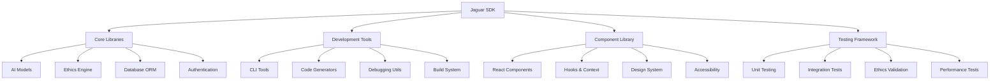

# Jaguar SDK Developer Guide

## Overview

The Jaguar SDK provides a comprehensive set of tools, libraries, and components for building conscious AI applications. This guide covers all the traditional SDK components enhanced with modern development practices and Cline integration.

## SDK Architecture



## Core Libraries

### 1. AI Models (`@jaguar-sdk/ai`)

The core AI integration library providing access to multiple AI providers.

#### Installation

```bash
npm install @jaguar-sdk/ai
```

#### Basic Usage

```typescript
import { JaguarAI, createAgent } from "@jaguar-sdk/ai";

// Initialize AI client
const ai = new JaguarAI({
  provider: "xai",
  apiKey: process.env.XAI_API_KEY,
  ethics: {
    earthCare: true,
    peopleCare: true,
    fairShare: true,
  },
});

// Create an agent
const agent = createAgent({
  name: "EcoAssistant",
  purpose: "Help users make environmentally conscious decisions",
  model: "grok-beta",
  systemPrompt: `You are an AI assistant focused on environmental sustainability...`,
});
```

#### Advanced Features

```typescript
// Multi-model orchestration
const response = await ai.orchestrate({
  models: ["grok-beta", "claude-3-sonnet"],
  prompt: "Design a regenerative agriculture system",
  consensus: "majority",
  ethicsValidation: true,
});

// Streaming responses
const stream = ai.streamResponse({
  agent: "EcoAssistant",
  message: "How can I reduce my carbon footprint?",
});

for await (const chunk of stream) {
  console.log(chunk.content);
}
```

### 2. Ethics Engine (`@jaguar-sdk/ethics`)

Ensures all AI interactions align with permaculture principles.

#### Core Principles

```typescript
import { EthicsEngine, validateDecision } from "@jaguar-sdk/ethics";

const ethics = new EthicsEngine({
  principles: {
    earthCare: {
      weight: 0.4,
      criteria: ["environmental_impact", "sustainability", "regeneration"],
    },
    peopleCare: {
      weight: 0.4,
      criteria: ["human_wellbeing", "accessibility", "inclusivity"],
    },
    fairShare: {
      weight: 0.2,
      criteria: ["resource_distribution", "equity", "transparency"],
    },
  },
});

// Validate AI decisions
const decision = await validateDecision({
  action: "recommend_product",
  context: { user_query: "sustainable clothing options" },
  response: "I recommend these eco-friendly brands...",
});

if (decision.ethicsScore < 0.8) {
  // Reject or modify the response
  console.warn("Ethics validation failed:", decision.violations);
}
```

### 3. Database ORM (`@jaguar-sdk/db`)

Enhanced Drizzle ORM with sustainability tracking.

#### Schema Definition

```typescript
import { pgTable, serial, text, timestamp, jsonb } from "@jaguar-sdk/db";

export const agents = pgTable("agents", {
  id: serial("id").primaryKey(),
  name: text("name").notNull(),
  purpose: text("purpose").notNull(),
  ethicsConfig: jsonb("ethics_config"),
  carbonFootprint: jsonb("carbon_footprint"),
  createdAt: timestamp("created_at").defaultNow(),
  updatedAt: timestamp("updated_at").defaultNow(),
});

export const conversations = pgTable("conversations", {
  id: serial("id").primaryKey(),
  agentId: integer("agent_id").references(() => agents.id),
  messages: jsonb("messages"),
  ethicsScore: real("ethics_score"),
  sustainabilityMetrics: jsonb("sustainability_metrics"),
  createdAt: timestamp("created_at").defaultNow(),
});
```

#### Sustainability Tracking

```typescript
import { trackSustainability, generateReport } from "@jaguar-sdk/db";

// Track environmental impact
await trackSustainability({
  action: "ai_inference",
  model: "grok-beta",
  tokens: 1500,
  energyUsage: 0.025, // kWh
  carbonEmissions: 0.012, // kg CO2
});

// Generate sustainability report
const report = await generateReport({
  timeframe: "monthly",
  metrics: ["carbon_footprint", "energy_usage", "resource_efficiency"],
});
```

## Development Tools

### 1. CLI Tools (`@jaguar-sdk/cli`)

Command-line interface for project management and development.

#### Installation

```bash
npm install -g @jaguar-sdk/cli
```

#### Commands

##### Project Creation

```bash
# Create new project
jaguar create my-agent --template=basic
jaguar create eco-platform --template=marketplace
jaguar create community-app --template=social

# With Cline integration
jaguar create my-project --with-cline --ethics=permaculture
```

##### Agent Management

```bash
# Generate agent
jaguar generate agent EcoAssistant --purpose="environmental guidance"

# Deploy agent
jaguar deploy agent EcoAssistant --environment=production

# Test agent ethics
jaguar test ethics EcoAssistant --validate-all
```

##### Database Operations

```bash
# Run migrations
jaguar db migrate

# Seed with sample data
jaguar db seed --environment=development

# Generate sustainability report
jaguar db report --type=sustainability --format=json
```

### 2. Code Generators

Automated code generation for common patterns.

#### Component Generation

```bash
# Generate React component
jaguar generate component AgentCard --with-tests --accessible

# Generate API endpoint
jaguar generate api agents --crud --with-validation

# Generate database schema
jaguar generate schema projects --with-sustainability-tracking
```

#### Generated Component Example

```typescript
// Generated: components/AgentCard.tsx
import React from "react";
import { Agent } from "@jaguar-sdk/types";
import { useEthicsValidation } from "@jaguar-sdk/hooks";

interface AgentCardProps {
  agent: Agent;
  onInteract?: (agentId: string) => void;
  className?: string;
}

export const AgentCard: React.FC<AgentCardProps> = ({
  agent,
  onInteract,
  className = "",
}) => {
  const { ethicsScore, isValidated } = useEthicsValidation(agent);

  return (
    <div
      className={`agent-card ${className}`}
      role="article"
      aria-labelledby={`agent-${agent.id}-title`}
    >
      <h3 id={`agent-${agent.id}-title`}>{agent.name}</h3>
      <p>{agent.purpose}</p>

      <div className="ethics-indicator">
        <span aria-label={`Ethics score: ${ethicsScore}/100`}>
          🌱 {ethicsScore}/100
        </span>
      </div>

      <button
        onClick={() => onInteract?.(agent.id)}
        aria-describedby={`agent-${agent.id}-description`}
      >
        Interact with Agent
      </button>
    </div>
  );
};
```

### 3. Debugging Utilities

Advanced debugging tools for AI applications.

#### Ethics Debugger

```typescript
import { EthicsDebugger } from '@jaguar-sdk/debug';

const debugger = new EthicsDebugger({
  logLevel: 'verbose',
  trackDecisions: true,
  validateRealtime: true
});

// Debug agent decision
await debugger.traceDecision({
  agent: 'EcoAssistant',
  input: 'Should I buy this product?',
  context: { user_preferences: 'sustainability' }
});

// Output:
// ✅ Earth Care: Score 85/100
//    - Environmental impact: Low
//    - Sustainability: High
// ⚠️  People Care: Score 65/100
//    - Accessibility: Medium
//    - Inclusivity: Needs improvement
// ✅ Fair Share: Score 90/100
//    - Resource distribution: Excellent
```

#### Performance Profiler

```typescript
import { PerformanceProfiler } from "@jaguar-sdk/debug";

const profiler = new PerformanceProfiler();

// Profile AI inference
const result = await profiler.profile(async () => {
  return await ai.generateResponse({
    prompt: "Complex sustainability analysis...",
    model: "grok-beta",
  });
});

console.log(result.metrics);
// {
//   duration: 1250, // ms
//   tokensPerSecond: 45,
//   energyUsage: 0.025, // kWh
//   carbonFootprint: 0.012 // kg CO2
// }
```

## Component Library

### 1. React Components (`@jaguar-sdk/components`)

Pre-built, accessible React components for AI interfaces.

#### Installation

```bash
npm install @jaguar-sdk/components
```

#### Core Components

##### Chat Interface

```typescript
import { ChatInterface, Message } from "@jaguar-sdk/components";

const MyApp = () => {
  const [messages, setMessages] = useState<Message[]>([]);

  return (
    <ChatInterface
      messages={messages}
      onSendMessage={handleSendMessage}
      agent={{
        name: "EcoAssistant",
        avatar: "/avatars/eco-assistant.png",
        ethicsScore: 95,
      }}
      ethicsValidation={true}
      sustainabilityTracking={true}
      accessibility={{
        screenReader: true,
        keyboardNavigation: true,
        highContrast: true,
      }}
    />
  );
};
```

##### Agent Marketplace

```typescript
import { AgentMarketplace, AgentFilter } from "@jaguar-sdk/components";

const MarketplacePage = () => {
  return (
    <AgentMarketplace
      filters={[
        {
          type: "category",
          options: ["sustainability", "education", "health"],
        },
        { type: "ethicsScore", min: 80 },
        { type: "carbonNeutral", value: true },
      ]}
      sortBy="ethicsScore"
      onAgentSelect={handleAgentSelect}
      sustainabilityBadges={true}
    />
  );
};
```

##### Progress Tracking

```typescript
import { SustainabilityDashboard } from "@jaguar-sdk/components";

const Dashboard = () => {
  return (
    <SustainabilityDashboard
      metrics={{
        carbonFootprint: { current: 12.5, target: 10, unit: "kg CO2/month" },
        energyEfficiency: { score: 85, trend: "improving" },
        communityImpact: { projects: 15, beneficiaries: 1250 },
      }}
      goals={[
        { name: "Carbon Neutral by 2025", progress: 65 },
        { name: "Zero Waste Operations", progress: 40 },
      ]}
      interactive={true}
    />
  );
};
```

### 2. Hooks & Context (`@jaguar-sdk/hooks`)

React hooks for common AI and sustainability patterns.

#### Ethics Hooks

```typescript
import {
  useEthicsValidation,
  usePermaculturePrinciples,
} from "@jaguar-sdk/hooks";

const AgentComponent = ({ agent }) => {
  const { ethicsScore, violations, isValidated } = useEthicsValidation(agent);
  const { earthCare, peopleCare, fairShare } = usePermaculturePrinciples(agent);

  return (
    <div>
      <h3>{agent.name}</h3>
      <EthicsIndicator
        score={ethicsScore}
        principles={{ earthCare, peopleCare, fairShare }}
      />
    </div>
  );
};
```

#### Sustainability Hooks

```typescript
import {
  useSustainabilityTracking,
  useCarbonFootprint,
} from "@jaguar-sdk/hooks";

const SustainableComponent = () => {
  const { trackAction, getMetrics } = useSustainabilityTracking();
  const { footprint, reduction, goals } = useCarbonFootprint();

  const handleAIInteraction = async () => {
    await trackAction({
      type: "ai_inference",
      model: "grok-beta",
      tokens: 500,
    });
  };

  return (
    <div>
      <p>Current footprint: {footprint.current} kg CO2</p>
      <p>Reduction this month: {reduction.percentage}%</p>
    </div>
  );
};
```

## Testing Framework

### 1. Unit Testing (`@jaguar-sdk/testing`)

Specialized testing utilities for AI applications.

#### Ethics Testing

```typescript
import { ethicsTest, validatePermaculture } from "@jaguar-sdk/testing";

describe("EcoAssistant Agent", () => {
  ethicsTest("should prioritize environmental sustainability", async () => {
    const response = await agent.respond("Should I buy fast fashion?");

    expect(response).toPassEthicsValidation();
    expect(response).toAlignWithPrinciple("earthCare");
    expect(response.ethicsScore).toBeGreaterThan(80);
  });

  validatePermaculture("should demonstrate all three principles", async () => {
    const decisions = await agent.makeDecisions([
      "environmental choice",
      "social impact decision",
      "resource allocation",
    ]);

    expect(decisions).toBalanceAllPrinciples();
  });
});
```

#### Performance Testing

```typescript
import { performanceTest, sustainabilityBenchmark } from "@jaguar-sdk/testing";

describe("Agent Performance", () => {
  performanceTest("should respond within sustainability limits", async () => {
    const result = await agent.respond("Complex query...");

    expect(result.metrics.energyUsage).toBeLessThan(0.05); // kWh
    expect(result.metrics.carbonEmissions).toBeLessThan(0.025); // kg CO2
    expect(result.metrics.responseTime).toBeLessThan(2000); // ms
  });

  sustainabilityBenchmark("should improve efficiency over time", async () => {
    const baseline = await getBenchmarkMetrics();
    const current = await getCurrentMetrics();

    expect(current.efficiency).toBeGreaterThan(baseline.efficiency);
    expect(current.carbonIntensity).toBeLessThan(baseline.carbonIntensity);
  });
});
```

### 2. Integration Testing

End-to-end testing for complete workflows.

```typescript
import { integrationTest, mockSustainabilityAPI } from "@jaguar-sdk/testing";

integrationTest("complete agent interaction workflow", async () => {
  // Setup
  const testAgent = await createTestAgent("EcoAssistant");
  const mockUser = createMockUser({ preferences: "sustainability" });

  // Test interaction
  const conversation = await startConversation(testAgent, mockUser);
  const response = await conversation.send(
    "Help me choose sustainable products"
  );

  // Validate
  expect(response).toBeEthicallySound();
  expect(response).toIncludeSustainabilityMetrics();
  expect(conversation.ethicsScore).toBeGreaterThan(85);

  // Verify tracking
  const metrics = await getSustainabilityMetrics(conversation.id);
  expect(metrics.carbonFootprint).toBeDefined();
  expect(metrics.energyUsage).toBeLessThan(0.1);
});
```

## Best Practices

### 1. Ethics-First Development

Always start with ethical considerations:

```typescript
// ✅ Good: Ethics validation built-in
const agent = createAgent({
  name: "Assistant",
  ethicsConfig: {
    principles: ["earthCare", "peopleCare", "fairShare"],
    validationLevel: "strict",
    fallbackBehavior: "refuse_unethical",
  },
});

// ❌ Bad: No ethics consideration
const agent = createAgent({
  name: "Assistant",
  model: "gpt-4",
});
```

### 2. Sustainability Tracking

Monitor environmental impact:

```typescript
// ✅ Good: Comprehensive tracking
const response = await ai.generateResponse({
  prompt: "User query...",
  trackSustainability: true,
  optimizeForEfficiency: true,
  carbonBudget: 0.01, // kg CO2 limit
});

// ❌ Bad: No sustainability consideration
const response = await ai.generateResponse({
  prompt: "User query...",
});
```

### 3. Accessibility

Ensure inclusive design:

```typescript
// ✅ Good: Accessible component
<AgentCard
  agent={agent}
  aria-label={`${agent.name}: ${agent.purpose}`}
  keyboardNavigable={true}
  screenReaderOptimized={true}
  highContrastMode={userPreferences.highContrast}
/>

// ❌ Bad: No accessibility features
<div onClick={handleClick}>
  {agent.name}
</div>
```

## Migration Guide

### From Traditional SDKs

If you're coming from traditional AI SDKs:

1. **Add Ethics Configuration**

   ```typescript
   // Before
   const client = new OpenAI({ apiKey: "key" });

   // After
   const client = new JaguarAI({
     apiKey: "key",
     ethics: { earthCare: true, peopleCare: true, fairShare: true },
   });
   ```

2. **Include Sustainability Tracking**

   ```typescript
   // Before
   const response = await client.chat.completions.create({
     model: "gpt-4",
     messages: [{ role: "user", content: "Hello" }],
   });

   // After
   const response = await client.generateResponse({
     model: "grok-beta",
     messages: [{ role: "user", content: "Hello" }],
     trackSustainability: true,
     ethicsValidation: true,
   });
   ```

3. **Use Conscious Components**

   ```typescript
   // Before
   <div>
     <input onChange={handleInput} />
     <button onClick={handleSubmit}>Send</button>
   </div>

   // After
   <ChatInterface
     onSendMessage={handleSubmit}
     ethicsValidation={true}
     sustainabilityTracking={true}
     accessibility={{ screenReader: true }}
   />
   ```

## Community & Support

### Getting Help

- **Documentation**: [docs.jaguar-sdk.dev](https://docs.jaguar-sdk.dev)
- **Discord**: [discord.gg/jaguar-sdk](https://discord.gg/jaguar-sdk)
- **GitHub**: [github.com/serenelion/jaguar-sdk](https://github.com/serenelion/jaguar-sdk)

### Contributing

1. **Code Contributions**: Follow the ethics-first development guidelines
2. **Documentation**: Help improve guides and examples
3. **Community**: Share your sustainable AI projects
4. **Feedback**: Report issues and suggest improvements

### Roadmap

- **Q1 2025**: Enhanced ethics engine with ML-based validation
- **Q2 2025**: Carbon-neutral inference optimization
- **Q3 2025**: Community governance tools
- **Q4 2025**: Regenerative AI marketplace

---

_"Technology that serves life, guided by the wisdom of seven generations."_ - Jaguar SDK Philosophy
