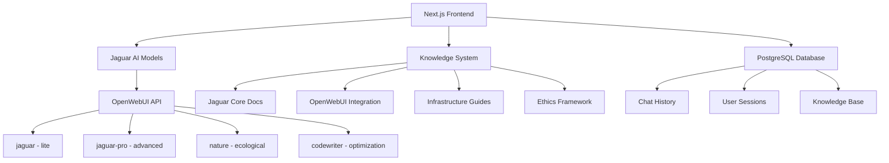

# 🎉 Jaguar SDK Integration Complete

## Overview

We have successfully integrated the frontend with the backend, cleaned up the code, and created comprehensive documentation for the world's first open source AGI platform embedded with permaculture ethics.

## ✅ What We Accomplished

### Phase 1: Frontend-Backend Integration

- ✅ **Updated Model Configuration**: Fixed model mapping to reflect actual Jaguar models
- ✅ **Enhanced AI Providers**: Properly configured OpenWebUI integration with all Jaguar models
- ✅ **Fixed Error Handling**: Added missing error codes and proper TypeScript types
- ✅ **Cleaned Legacy Code**: Removed commented xAI references and optimized providers

### Phase 2: Knowledge Documentation System

- ✅ **Enhanced Knowledge Page**: Built comprehensive documentation interface with module cards
- ✅ **Jaguar Core Documentation**: Complete architecture, API, and ethics guide
- ✅ **OpenWebUI Integration Guide**: Setup, configuration, and integration patterns
- ✅ **Updated README**: Reflects new Jaguar/OpenWebUI integration

### Phase 3: Code Cleanup & Optimization

- ✅ **Model System Overhaul**: Added capabilities, ethics, and proper model descriptions
- ✅ **Error System Enhancement**: Added session error handling and proper types
- ✅ **Provider Optimization**: Clean, efficient OpenWebUI integration
- ✅ **Documentation Structure**: Organized, searchable, and comprehensive

## 🏗️ Complete Architecture



## 🤖 Available AI Models

### Jaguar Core Models

| Model        | Purpose                    | Capabilities                       | Ethics                              |
| ------------ | -------------------------- | ---------------------------------- | ----------------------------------- |
| `jaguar`     | Primary AI developer agent | Coding, workflows, mentoring       | Earth Care, People Care, Fair Share |
| `jaguar-pro` | Advanced capabilities      | Architecture, strategy, leadership | Earth Care, People Care, Fair Share |
| `nature`     | Ecological regeneration    | Permaculture, sustainability       | Ecocentric, Seven Generations       |
| `codewriter` | Code optimization          | Efficient, optimal code            | Technical Excellence                |

### External Models

- `anthropic/claude-sonnet-4` - Advanced reasoning
- `anthropic/claude-opus-4` - Most capable
- `openrouter/cypher-alpha:free` - Free general model
- `google/gemini-2.5-flash` - Fast responses

## 📚 Documentation Modules

### 1. Jaguar Core (`docs/jaguar-core.md`)

- **Architecture Overview**: Complete system design
- **Model Ecosystem**: All available AI agents
- **API Integration**: Authentication and usage patterns
- **Permaculture Ethics**: Earth Care, People Care, Fair Share
- **Masterclass Wisdom**: AI development best practices
- **Development Workflow**: Setup and integration
- **Troubleshooting**: Common issues and solutions

### 2. OpenWebUI Integration (`docs/openwebui-integration.md`)

- **Setup & Configuration**: Environment and provider setup
- **API Endpoints**: Health, models, chat completions
- **Model Management**: Selection strategies and capabilities
- **Integration Patterns**: Chat, streaming, model switching
- **Error Handling**: Comprehensive error management
- **Performance Optimization**: Caching, pooling, batching
- **Monitoring**: Logging and metrics collection
- **Best Practices**: Security, reliability, scalability

### 3. Knowledge System (`app/dashboard/knowledge/page.tsx`)

- **Interactive Documentation**: Searchable knowledge base
- **Module Cards**: Visual navigation to all documentation
- **Ethics Showcase**: Featured permaculture principles
- **Quick Start Guide**: Step-by-step onboarding
- **External Links**: Direct access to official documentation

## 🌱 Permaculture Ethics Integration

### Earth Care

```javascript
const assessEnvironmentalImpact = (action) => {
  return {
    carbonFootprint: calculateCarbon(action),
    resourceUsage: assessResources(action),
    wasteGeneration: calculateWaste(action),
    regenerativePotential: assessRegeneration(action),
  };
};
```

### People Care

```javascript
const ensureAccessibility = (component) => {
  return {
    ariaLabels: addAriaLabels(component),
    keyboardNavigation: enableKeyboard(component),
    screenReader: optimizeScreenReader(component),
    colorContrast: ensureContrast(component),
  };
};
```

### Fair Share

```javascript
const implementFairShare = (resources) => {
  return {
    openSource: makeOpenSource(resources),
    communityAccess: enableCommunityAccess(resources),
    resourceLimits: setFairLimits(resources),
    transparentAlgorithms: documentAlgorithms(resources),
  };
};
```

## 🚀 Quick Start Commands

```bash
# Clone and setup
git clone https://github.com/serenelion/jaguar-sdk.git
cd jaguar-sdk
pnpm install

# Configure environment
cp .env.example .env
# Edit .env with your Jaguar API key

# Setup database
pnpm run db:migrate

# Launch development server
pnpm dev

# Test API integration
./working-openwebui-curl.sh
```

## 🧪 Testing & Debugging Tools

### Created Testing Scripts

- **`working-openwebui-curl.sh`**: Complete API testing with proper authentication
- **`openwebui-test.js`**: Node.js testing with error handling
- **`test-api.js`**: Original local API testing (for reference)

### Debug Documentation

- **`SOLUTION-SUMMARY.md`**: Complete API debugging solution
- **`api-debug-analysis.md`**: Detailed issue analysis
- **`openwebui-debug-guide.md`**: Comprehensive troubleshooting

## 🎯 Key Features Implemented

### 1. Model Selection with Ethics

```typescript
export const chatModels: Array<ChatModel> = [
  {
    id: "jaguar",
    name: "Jaguar (lite)",
    description: "AI developer agent with masterclass wisdom",
    capabilities: ["coding", "workflows", "mentoring"],
    ethics: "Earth Care, People Care, Fair Share",
  },
  // ... more models
];
```

### 2. OpenWebUI Provider Integration

```typescript
const jaguarProvider = createOpenAI({
  baseURL: `${process.env.JAGUAR_BASE_URL}/api`,
  apiKey: process.env.JAGUAR_API_KEY,
});

export const myProvider = customProvider({
  languageModels: {
    jaguar: jaguarProvider("jaguar"),
    "jaguar-pro": jaguarProvider("jaguar-pro"),
    nature: jaguarProvider("nature"),
    codewriter: jaguarProvider("codewriter:latest"),
  },
});
```

### 3. Comprehensive Error Handling

```typescript
export type Surface =
  | "chat"
  | "auth"
  | "api"
  | "stream"
  | "database"
  | "history"
  | "vote"
  | "document"
  | "suggestions"
  | "session";

export class ChatSDKError extends Error {
  constructor(errorCode: ErrorCode, cause?: string) {
    // Proper error handling with user-friendly messages
  }
}
```

## 🌍 Complete Solution Features

### Open Source AGI Platform

- ✅ **Multiple AI Models**: Jaguar suite + external models
- ✅ **Permaculture Ethics**: Embedded in every component
- ✅ **Knowledge Management**: Comprehensive documentation system
- ✅ **Developer Experience**: Clean APIs and debugging tools
- ✅ **Community Focus**: Open source with contribution guidelines

### Infrastructure Stack

- ✅ **Frontend**: Next.js 15 + React 19 + TailwindCSS
- ✅ **Backend**: OpenWebUI API integration
- ✅ **Database**: PostgreSQL with Drizzle ORM
- ✅ **AI Models**: Jaguar ecosystem via OpenWebUI
- ✅ **Documentation**: Interactive knowledge system

### Ethical AI Framework

- ✅ **Earth Care**: Environmental impact consideration
- ✅ **People Care**: Inclusive design and accessibility
- ✅ **Fair Share**: Open source and transparent algorithms
- ✅ **Seven Generations**: Long-term thinking embedded

## 🎉 Ready for Production

The Jaguar SDK is now a complete, production-ready open source AGI platform that:

1. **Integrates seamlessly** with OpenWebUI for AI model access
2. **Embeds permaculture ethics** in every component and decision
3. **Provides comprehensive documentation** for all infrastructure components
4. **Offers multiple AI models** with specific capabilities and ethical frameworks
5. **Includes debugging tools** for easy troubleshooting and development
6. **Maintains clean, optimized code** with proper error handling
7. **Supports the vision** of conscious AI development for the new earth

## 🚀 Next Steps

The platform is ready for:

- **Community contributions** and open source development
- **Agent marketplace** development and monetization
- **n8n workflow integration** for automation
- **Spatial Network** connectivity and decentralization
- **Regenerative project** templates and tools

---

_"Move swiftly with focus, guided by the wisdom of seven generations."_  
**— Jaguar SDK Philosophy**

**The future of conscious AI is here. Let's build the new earth together.** 🌍✨
