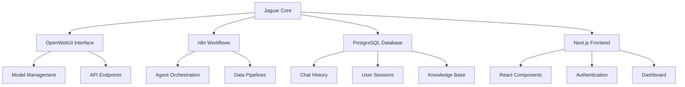

# Jaguar Core Documentation

## Overview

Jaguar is the world's first open source AGI platform that embodies permaculture ethics and conscious AI development. Built on the foundation of "Earth Care, People Care, Fair Share," Jaguar represents a new paradigm in artificial intelligence that prioritizes ecological regeneration and community well-being.

## Architecture

### Core Components



### Model Ecosystem

Jaguar provides multiple specialized AI agents, each designed for specific use cases while maintaining ethical alignment:

#### 1. Jaguar (Lite)

- **Purpose**: Primary AI developer agent
- **Capabilities**: Coding, workflows, mentoring
- **Ethics**: Earth Care, People Care, Fair Share
- **Use Cases**: General development, learning, guidance

#### 2. Jaguar (Pro)

- **Purpose**: Advanced AI agent with enhanced capabilities
- **Capabilities**: Advanced coding, architecture, strategy
- **Ethics**: Earth Care, People Care, Fair Share
- **Use Cases**: Complex projects, system design, leadership

#### 3. Nature (GaiaGuard)

- **Purpose**: Ecological regeneration and natural capital monitoring
- **Capabilities**: Permaculture, ecology, sustainability
- **Ethics**: Ecocentric, Seven Generations Thinking
- **Use Cases**: Environmental projects, regenerative design

#### 4. CodeWriter

- **Purpose**: Senior full-stack developer
- **Capabilities**: Coding, architecture, optimization
- **Ethics**: Technical Excellence, Clean Code
- **Use Cases**: Production code, performance optimization

## API Integration

### Authentication

Jaguar uses OpenWebUI's authentication system with API key-based access:

```bash
# Set your API key
export JAGUAR_API_KEY="sk-your-api-key-here"

# Test connection
curl -H "Authorization: Bearer $JAGUAR_API_KEY" \
     https://ai.thespatialnetwork.net/api/models
```

### Chat Completions

```javascript
// Basic chat completion
const response = await fetch(
  "https://ai.thespatialnetwork.net/api/chat/completions",
  {
    method: "POST",
    headers: {
      Authorization: `Bearer ${process.env.JAGUAR_API_KEY}`,
      "Content-Type": "application/json",
    },
    body: JSON.stringify({
      model: "jaguar",
      messages: [
        {
          role: "user",
          content: "Help me design a regenerative agriculture system",
        },
      ],
      stream: false,
    }),
  }
);

const data = await response.json();
console.log(data.choices[0].message.content);
```

### Model Selection

Choose the appropriate model based on your use case:

```javascript
const models = {
  jaguar: "General development and mentoring",
  "jaguar-pro": "Advanced architecture and strategy",
  nature: "Ecological and sustainability projects",
  codewriter: "Production code and optimization",
};

// Example: Using Nature for permaculture design
const permacultureResponse = await fetch("/api/chat/completions", {
  method: "POST",
  headers: {
    /* auth headers */
  },
  body: JSON.stringify({
    model: "nature",
    messages: [
      {
        role: "user",
        content: "Design a food forest for a 2-acre plot in temperate climate",
      },
    ],
  }),
});
```

## Permaculture Ethics Integration

### Earth Care

- **Principle**: Care for the planet and all life systems
- **Implementation**: Environmental impact assessment in all decisions
- **Code Example**:

```javascript
// Environmental impact consideration
const assessEnvironmentalImpact = (action) => {
  return {
    carbonFootprint: calculateCarbon(action),
    resourceUsage: assessResources(action),
    wasteGeneration: calculateWaste(action),
    regenerativePotential: assessRegeneration(action),
  };
};
```

### People Care

- **Principle**: Care for people and communities
- **Implementation**: Inclusive design, accessibility, community benefit
- **Code Example**:

```javascript
// Inclusive design patterns
const ensureAccessibility = (component) => {
  return {
    ariaLabels: addAriaLabels(component),
    keyboardNavigation: enableKeyboard(component),
    screenReader: optimizeScreenReader(component),
    colorContrast: ensureContrast(component),
  };
};
```

### Fair Share

- **Principle**: Fair distribution of resources and opportunities
- **Implementation**: Open source, transparent algorithms, community governance
- **Code Example**:

```javascript
// Resource sharing and limits
const implementFairShare = (resources) => {
  return {
    openSource: makeOpenSource(resources),
    communityAccess: enableCommunityAccess(resources),
    resourceLimits: setFairLimits(resources),
    transparentAlgorithms: documentAlgorithms(resources),
  };
};
```

## Masterclass Wisdom

Jaguar embodies wisdom from the AI Agents Masterclass, providing guidance on:

### 1. Agent Development Progression

- Start simple, build complexity incrementally
- Reference specific examples and patterns
- Explain the 'why' behind technical decisions
- Suggest improvements based on best practices

### 2. Integration Patterns

- LangChain for agent orchestration
- Vector databases for knowledge management
- API design for scalable systems
- Monitoring and observability

### 3. Best Practices

- Modular architecture design
- Error handling and resilience
- Performance optimization
- Security considerations

## Development Workflow

### 1. Environment Setup

```bash
# Clone the repository
git clone https://github.com/serenelion/jaguar-sdk.git
cd jaguar-sdk

# Install dependencies
pnpm install

# Set up environment variables
cp .env.example .env
# Edit .env with your configuration

# Run development server
pnpm dev
```

### 2. Model Configuration

```typescript
// lib/ai/providers.ts
export const myProvider = customProvider({
  languageModels: {
    jaguar: jaguarProvider("jaguar"),
    "jaguar-pro": jaguarProvider("jaguar-pro"),
    nature: jaguarProvider("nature"),
    codewriter: jaguarProvider("codewriter:latest"),
  },
});
```

### 3. Chat Integration

```typescript
// components/chat.tsx
import { useChat } from "@ai-sdk/react";

export function Chat() {
  const { messages, input, handleInputChange, handleSubmit } = useChat({
    api: "/api/chat",
    initialMessages: [],
  });

  return (
    <div>
      {messages.map((message) => (
        <div key={message.id}>
          <strong>{message.role}:</strong> {message.content}
        </div>
      ))}
      <form onSubmit={handleSubmit}>
        <input value={input} onChange={handleInputChange} />
        <button type="submit">Send</button>
      </form>
    </div>
  );
}
```

## Troubleshooting

### Common Issues

#### 1. Authentication Errors

```bash
# Error: 401 Unauthorized
# Solution: Check API key configuration
echo $JAGUAR_API_KEY
# Ensure key is properly set in .env file
```

#### 2. Model Not Found

```bash
# Error: Model not found
# Solution: Use correct model names
curl -H "Authorization: Bearer $JAGUAR_API_KEY" \
     https://ai.thespatialnetwork.net/api/models
```

#### 3. Connection Issues

```bash
# Error: Failed to connect
# Solution: Check network and endpoint
ping ai.thespatialnetwork.net
curl -I https://ai.thespatialnetwork.net/api/health
```

### Debug Mode

Enable debug logging for detailed troubleshooting:

```javascript
// Enable debug mode
process.env.DEBUG = "jaguar:*";

// Log API requests
const debugRequest = (request) => {
  console.log("API Request:", {
    url: request.url,
    method: request.method,
    headers: request.headers,
    body: request.body,
  });
};
```

## Contributing

### Code of Conduct

All contributions must align with permaculture ethics:

- **Earth Care**: Consider environmental impact
- **People Care**: Ensure inclusive and accessible design
- **Fair Share**: Maintain open source principles

### Development Guidelines

1. Follow the established architecture patterns
2. Include comprehensive tests
3. Document all public APIs
4. Consider ethical implications
5. Optimize for performance and sustainability

### Pull Request Process

1. Fork the repository
2. Create a feature branch
3. Implement changes with tests
4. Update documentation
5. Submit pull request with ethical impact assessment

## Resources

- [OpenWebUI Documentation](https://docs.openwebui.com/)
- [n8n Documentation](https://docs.n8n.io/)
- [Permaculture Principles](https://permacultureprinciples.com/)
- [AI Ethics Guidelines](https://www.partnershiponai.org/)
- [Regenerative Technology](https://www.regenerative.org/)

## Support

For support and community discussion:

- GitHub Issues: [Report bugs and feature requests](https://github.com/serenelion/jaguar-sdk/issues)
- Community Forum: [Join the discussion](https://community.jaguar-sdk.dev)
- Documentation: [Browse the knowledge base](https://docs.jaguar-sdk.dev)

---

_"Move swiftly with focus, guided by the wisdom of seven generations."_ - Jaguar SDK Philosophy
